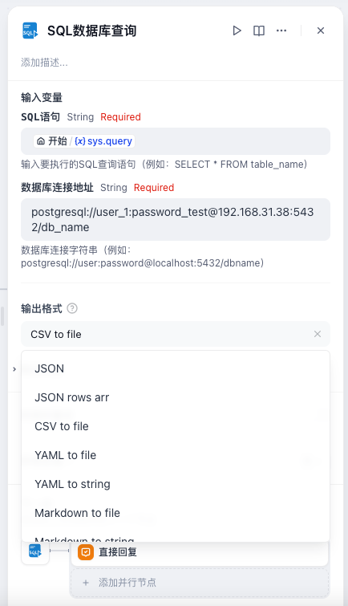
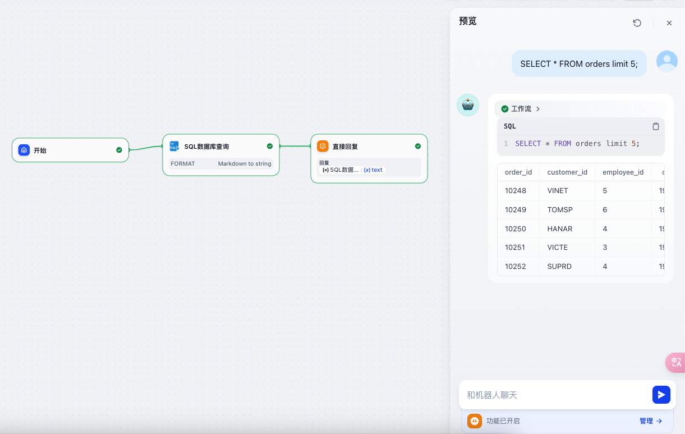
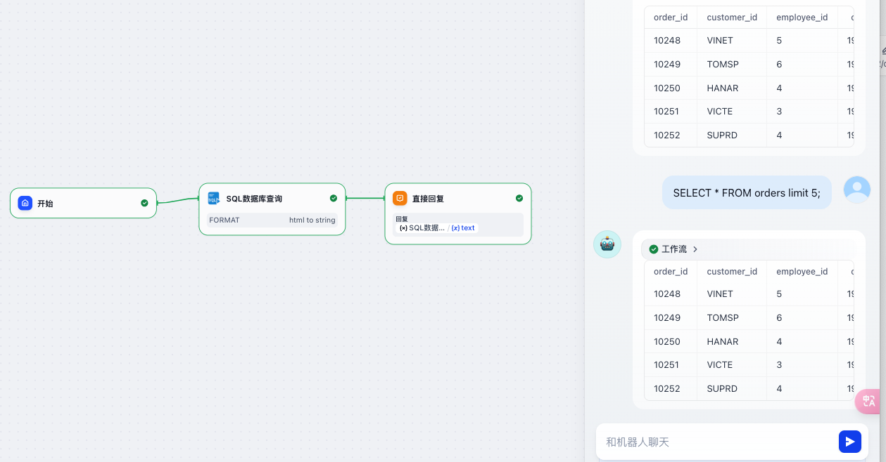

# SQL 数据库工具 (sql-db)

[English](README.md) | [中文](README_CN.md)

一个简单高效的 SQL 数据库查询工具。

**作者:** qjzt_cn  
**版本:** 0.0.1  
**类型:** 工具  
**代码仓库:** [https://github.com/QJZT/sql-db](https://github.com/QJZT/sql-db)

## 特点

- 轻量级依赖，仅使用两个核心库：
  - sqlalchemy>=2.0.0
  - psycopg2-binary>=2.9.9

- 简化使用流程：
  - 无需复杂的 URL 授权配置
  - 直接传入数据库连接参数即可使用
  - 支持标准 SQL 操作（SELECT）

## 使用示例

